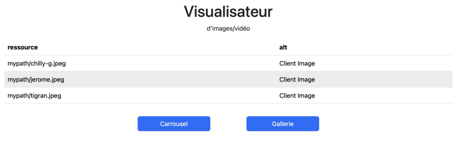

Contexte
---
Dans ce projet, votre but est 1) de lister et  ́eventuellement r ́ecup ́erer les
ressources ( ́eléments img et video) d’une page HTML donn ́ee et 2) de cr ́eer
une page HTML 5 dynamique qui permet la visualisation de ces ressources.
Vous allez pour cela d ́evelopper deux scripts qui devront fonctionner sous
l’environnement Linux du DIRO. Vous allez donc potentiellement manipuler
le scriptage (csh, bash ou python) faisant ou non usage de librairies comme
[beautiful soup](https://www.crummy.com/software/BeautifulSoup/bs4/doc/) vue en d ́emonstration et vous devrez produire des ressources
HTML/CSS/javascript qui devront toutes ˆetre aux normes.
L’url https://www-ens.iro.umontreal.ca/hiver/<usager>/index.html est
abrit ́ee pour m ́emoire dans le r ́epertoire suivant sur votre compte au DIRO :
/home/www/ens/<usager>/public_html/index.html. Plus à ce sujet [ici](https://support.iro.umontreal.ca/doku.php?id=www-ens.iro.umontreal.ca).

# Cahier des charges
---
1. Ecrire une commande ´ extract qui prend en argument l’url d’une
page HTML et qui liste l’ensemble des ressources (images et vid´eo)
de cette page, Plusieurs options contrˆolent le comportement de cette
commande qui sont d´ecrites `a l’aide de ce synopsis :
* extract [-r <regex>] % liste seulement les ressources dont le nom matche l’expression régulière
* [-i] % ne liste pas les ´el´ements  (default: liste)
* [-v] % ne liste pas les ´el´ements <video> (default: liste)
* [-p <path>] % liste et copie les ressources img et/ou video de <url> dans le path (default: juste liste)
* [-h] % affiche le synopsis de la commande et les auteurs de la commande.
* <url>
Vous pouvez utiliser le ou les languages de votre choix, mais nous lancerons votre commande comme indiqu´e dans les exemples qui suivent et qui sont donc normatifs (ils d´efinissent les attentes du cahier des charges). Vous pouvez ajouter des options (par exemple -R <regex>
pourrait éliminer (filtrer) les ressources dont la source matche l’expression r´egulière). Dans les exemples qui suivent, une flèche -> indique que la ligne est plus longue que la largeur de la page et l’affichage de cette ligne continue sur la ligne suivante et . . . indique que la ligne a été tronquée.

1) extract -v ”http://www-labs.iro.umontreal.ca/~felipe/brand_
new_home/creative-design/public_html/index.php?lg=fr”
demande de lister les attributs src et alt (lorsqu’ils existent) des
éléments img qui sont dans la page dont l’url est spécifiée. La sortie
devrait correspondre à :
PATH http://www-labs.iro.umontreal.ca/~felipe/brand_new_home/ ->
creative-design/public_html
IMAGE assets/imgs/logoRALI.png "to RALI"
IMAGE assets/imgs/university-of-montreal-squarelogo.png
IMAGE assets/imgs/sleepy-student.jpg "About us"
IMAGE assets/imgs/student.png "About us"
IMAGE assets/imgs/chilly-g.jpeg "Client Image"
IMAGE assets/imgs/jerome.jpeg "Client Image"
IMAGE assets/imgs/tigran.jpeg "Client Image"
IMAGE assets/imgs/felipe-2009.jpg
notez que la première ligne qui indique le path de l’url pass´ee en argument. Ainsi, l’url de la première image est http://www-labs.iro.
umontreal.ca/~felipe/brand_new_home/creative-design/public_
html/assets/imgs/logoRALI.png.
2) extract -p mypath -v ”http://www-labs.iro.umontreal.ca/
~felipe/brand_new_home/creative-design/public_html/index.php?
lg=fr”
demande de lister les attributs des éléments img qui sont dans la page
dont l’url est spécifiée tout en recopiant localement dans le répertoire
mypath les ressources (images) de cette page. La sortie devrait correspondre à :
PATH mypath
IMAGE logoRALI.png "to RALI"
IMAGE university-of-montreal-squarelogo.png
IMAGE sleepy-student.jpg "About us"
IMAGE student.png "About us"
IMAGE chilly-g.jpeg "Client Image"
IMAGE jerome.jpeg "Client Image"
IMAGE tigran.jpeg "Client Image"
IMAGE felipe-2009.jpg
notez qu’ici, la ligne PATH indique le répertoire dans lequel sont
copiées les ressources et que le champ src (2è colonne) des lignes
IMAGE est local à ce path.
3) extract -p mypath -r jpeg -v ”http://www-labs.iro.umontreal.
ca/~felipe/brand_new_home/creative-design/public_html/index.
php?lg=fr”
comme dans l’exemple pr´ec´edent, mais seules les ressources dont le
nom matche jpeg seront copiées/listées. La sortie devrait donc correspondre à :
PATH mypath
IMAGE chilly-g.jpeg "Client Image"
IMAGE jerome.jpeg "Client Image"
IMAGE tigran.jpeg "Client Image"
on peut consid´erer que l’expression régulière fournie à l’option -r est
une séquence de caractères (pas de caractères spéciaux du langage des
expressions régulières comme *).
4) extract ”https://zone.votresite.ca/site-web-blogue/photo-video-audio/
photos-et-videos:-quand-en-integrer-sur-votre-site-et-ou-vous-les-procurerrgCsl7aSdzo/”
demande de lister les attributs (src et éventuellement alt) des éléments
img et video qui sont dans la page dont l’url est spécifiée. La sortie
devrait correspondre à :
PATH https://zone.votresite.ca/site-web-blogue/photo-video-audio/ ...
IMAGE /img/logo-zone-votresite3.png "http://zone.votresite.ca"
IMAGE /images/icon-section-web.png
IMAGE /images/generale.jpg
VIDEO https://videos.francoischarron.com/~francois/medias.francois ...
IMAGE http://zone.votresite.ca/datascontent/pixabay.jpg "Pixabay"
IMAGE http://zone.votresite.ca/datascontent/istockphoto.jpg "iStockphoto"
dans le cas d’´el´ements video, la source affich´ee est soit la valeur de
l’attribut src s’il existe, l’attribut src du premier ´el´ement source
sinon.
2. Ecrire une commande **genere** qui lit sur l’entrée standard une liste de
ressources (images et/ou video) au format g´en´er´e par l’extracteur et
produit sur la sortie standard une page HTML5 qui permet de visualiser toutes les ressources list´ees. En voici un synopsis, vous pouvez
ajouter des options :
genere [ -h ] % affiche le synopsis de la commande et
les auteurs de la commande.
L`a encore, vous pouvez utiliser le ou les languages de votre choix, mais
nous lancerons votre commande tel qu’indiqu´e dans l’exemple qui suit
(qui est donc normatif).
5) extract -p mypath -r jpeg -v ”http://www-labs.iro.umontreal.
ca/~felipe/brand_new_home/creative-design/public_html/index.
php?lg=fr” | genere >! mapage.html
produit une page mapage.html qui doit ressembler à ceci, c’est à dire
une table HTML indiquant chaque ressource et son attribut alt si
disponible :

()

la page doit contenir deux boutons : Carrousel et Galerie qui permettent de visualiser les images de la page à l’aide d’un carrousel
(droite) ou d’une galerie (gauche) :

chacune de ces vues contient un bouton Back qui permet de revenir `a
la page initiale (la visualisation sous forme de table).
3. Vous devez produire un rapport au format pdf d’au plus 3 pages.
Ce rapport doit au moins contenir :
* le nom et le rˆole de chaque membre de l’´equipe.
* 3 urls de pages avec des images et/ou vid´eo ainsi que les 3 pages
HTML (abrit´ees au DIRO) permettant de visualiser ces 3 pages.
Les liens doivent ˆetre cliquables afin de faciliter la consultation.
* la liste des langages et librairies utilis´es pour coder votre projet.
* les traitements particuliers (qu’avez vous fait par exemple avec les
images donn´ees sous la forme svg ?) que vous avez r´ealis´e.
* si votre solution n’est pas enti`erement compatible avec les contraintes
´enonc´ees dans le sujet, indiquez comment lancer vos scripts afin
que Th´eo n’ait pas `a deviner comment le faire.

# Contraintes
---
* La page g´en´er´ee par genere propose par d´efaut une vue table. Le fait
de cliquer sur les diff´erents boutons doit modifier la vue en cours `a
l’aide de scriptage DOM : il n’existe qu’une seule page HTML (une par
url fournie `a la commande extract) et cette page ne doit pas contenir les trois vues (table, galerie, carrousel) que l’on rendrait visible ou
cacherait en fonction des clics : seule la table doit ˆetre encod´ee dans
votre page HTML.
* De mˆeme, lorsque l’on clique sur le bouton Back de la vue carrousel
ou galerie, c’est par scriptage que l’on doit repasser `a la vue table.
* Lorsque vous cliquez sur une ligne de la table (premi`ere figure), cela
doit faire apparaitre une fenˆetre (popup/bulle) avec la photo correspondant `a la ligne cliqu´ee, cette photo doit disparaˆıtre lorsqu’on
relˆache le clic.
* Le HTML ne doit contenir aucune commande css, de mˆeme que le
code javascript doit ˆetre enti`erement s´epar´e de la page HTML.
* Vos programmes doivent fonctionner sur les machines du DIRO, sans
imposer au correcteur une quelconque installation (librairie ou ressource).

# Notation
---
La note de 25 points d´ependra de diff´erents crit`eres, comme :
* Ad´equation au cahier des charges (deux commandes + des ressources
`a remettre)
* Ergonomie des pages g´en´er´ees par la commande HTML5
* Bonne gestion de l’aspect dynamique de vos pages
* Qualit´e du code (lisibilit´e, ´el´egance, bon choix des languages de programmation)
* Validit´e des ressources g´en´er´ees (HTML/CSS)
* Le respect des consignes

# Mise en garde
---
Dans la mesure où je vous demande de cr´eer des ressources abritées au DIRO, vous n’êtes pas à l’abri d’un plagiat (sans même le savoir) car les ressources web servies par le DIRO doivent ˆetre en lecture pour tous (chmod og+r). Ce faisant, rien n’empˆecherait une personne de r´ecup´erer vos pages. De mˆeme les commandes demand´ees doivent ˆetre ex´ecutables par tous. (mais pas en lecture). Plus en cours à ce sujet. Afin de r´eduire les risques, je vous recommande de cr´eer un path depuis l’endroit où sont abritées vos pages au DIRO avec un ou plusieurs r´epertoires au [nom improbable](https://stackoverflow.com/questions/2793812/generate-a-random-filename-in-unix-shell) (ex : yEW5g93BahmCcKVB 1) et dont les seuls droits d’accès sont en exécution pour les autres (o) et le groupe (g) (ex : chmod 711 yEW5g93BahmCcKVB).

# Remise
---
Le projet est `a faire en groupe de deux personnes 2
et ˆetre remis sur
Studium sous le libell´e projet1 au plus tard le dimanche 9 mars 2025 `a
23h59. Vous devez remettre votre code et votre rapport (format pdf) dans
une archive (gzip, tar, tar.gz) dont le nom est pr´efix´e de projet1-noms, o`u
noms est `a remplacer par l’identit´e des personnes impliqu´ees dans le projet
(pr´enom1 nom1+pr´enom2 nom2). Cette archive doit comporter votre rapport,
le code de vos commandes (et d´ependances). Chaque ´el´ement de votre archive
doit porter les noms des personnes impliqu´ees. Par exemple, votre rapport
portera le nom : pr´enom1 nom1+pr´enom2 nom2-rapport.pdf

# Questions & Addendum
---
* Posez vos questions sur le canal projet1 de discord. Prenez le temps de lire le sujet avant de poser des questions. Nous ne r´epondrons plus aux questions de compr´ehension trois jours avant la date butoir.
* Les commandes extract et genere seront lanc´ees en sp´ecifiant le path que vous identifierez dans votre rapport. Par exemple, si votre
commande extract se trouve ici (sur le serveur de fichier du DIRO) : /u/<user>/cours/IFT3225-Hivers2025/pratique/projet1/extract
alors la commande sera lanc´ee par : /u/<user>/cours/IFT3225-Hivers2025/pratique/projet1/extract <args>.
